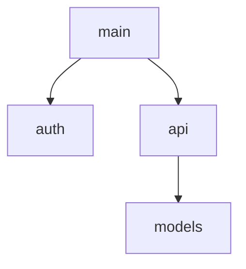

# Sync Context

Analyze current code and regenerate .context/ artifacts.

## When to Use
- Artifacts drifted out of sync with code
- Onboarding to unfamiliar codebase
- After major refactoring

## Steps

### 1. Analyze Code Structure
Scan `src/` for:
- Modules and packages
- Public classes and functions
- Import relationships

### 2. Regenerate ARCHITECTURE.md
Create module diagram:
```markdown
## Modules



## Key Abstractions
- `<Class>`: <purpose>
```

### 3. Validate CONVENTIONS.md
Compare actual patterns to documented conventions:
- Naming patterns in use
- Error handling approach
- Testing patterns

Flag discrepancies.

### 4. Update OVERVIEW.md
Check if scope description still matches:
- Dependencies in pyproject.toml
- Actual feature set

Update if drifted.

### 5. Sync DESIGN.md Status
For each feature in DESIGN.md:
- `[implementing]` → check if code exists, update to `[done]` if complete
- `[done]` → verify code still exists

### 6. Report
Summarize:
- Artifacts updated
- Discrepancies found
- Manual review needed (if any)
